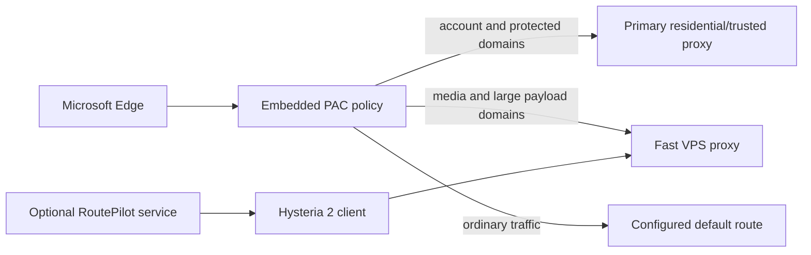

# RoutePilot for Windows

> Let the residential route handle consistency. Let the VPS route handle speed.

[中文说明](README.zh-CN.md)

## What does it do?

Suppose you have two network routes:

- a residential or trusted route that is useful for keeping account traffic on a consistent exit, but is slower, metered, or expensive;
- a fast VPS route with plenty of bandwidth, but one you do not want to use for account and login traffic.

RoutePilot automatically chooses between them in Microsoft Edge. Account pages and other protected domains use the primary route. Explicitly listed video CDN and large-download domains use the fast route. You keep using the same browser and do not switch proxies by hand.

An IP address itself does not impose a speed limit. The bottleneck usually comes from the residential proxy service, broadband plan, forwarding path, or traffic quota. RoutePilot does not make that route faster and does not combine two connections. It keeps expensive or sensitive traffic on one route and moves selected heavy payloads to the other.

## A concrete example

You open YouTube in Edge:

1. The YouTube page and Google account requests use your primary residential route.
2. Video payloads from `googlevideo.com` use the fast VPS route.
3. If the primary route stops, protected requests fail instead of silently leaking to direct access or the VPS route.
4. If RoutePilot manages the Hysteria 2 client, its Windows service can restart the client after a crash.

The same idea can be applied to software installers, GitHub release assets, and other explicitly selected large downloads.

## Measurements from the original deployment

RoutePilot grew out of a real two-route deployment. On 2026-08-02, using the same 5 MB Cloudflare test object for each route, we measured:

| Test | Original residential path | Final fast path | Change |
|---|---:|---:|---:|
| Median single connection | 7.02 Mbps | 37.93 Mbps | about 5.4x |
| Four concurrent transfers | 24.02 Mbps | 57.34 Mbps | about 2.4x |

That is **about 7 to 38 Mbps for a comparable single connection**, with the parallel test reaching about 57 Mbps. These are megabits per second, not megabytes per second; divide by eight for an approximate `MB/s` value.

This is one deployment's result, not a performance guarantee. VPS capacity, residential provider, congestion, loss, distance, and the test object all matter. See the [performance case study](docs/performance-case-study.md) for the full conditions and intermediate measurements.

## Why can it be faster?

In everyday terms, small and important account traffic stays on the trusted residential road, while video and download trucks use the wider VPS highway.

Technically, the PAC selects one of two local HTTP proxies per hostname. Account and page domains follow the primary residential/trusted path. Selected CDN and download domains use Hysteria 2 over UDP/QUIC to reach the VPS directly. Most of the gain comes from bypassing the residential forwarding path's bandwidth and quota bottlenecks; Hysteria 2 can also transport data more efficiently on high-latency or lossy paths. This is route selection, not bandwidth bonding.

## Who is it for?

RoutePilot is useful when you already have:

- one local HTTP proxy connected to a residential or otherwise trusted exit;
- one local HTTP proxy connected to a high-bandwidth VPS exit;
- Windows 10 or 11 and Microsoft Edge.

It does **not** sell IP addresses, create accounts, provision a remote server, or bypass platform controls. It only coordinates network routes that you own or are authorized to use.

## Test the routes visually

Start both local HTTP proxies, then double-click:

```text
Open-Dashboard.cmd
```

The neutral dashboard shows whether the RoutePilot Edge policy is active, whether each local proxy is reachable, each route's measured single-connection Mbps, and the bulk-to-primary speed ratio. It does not label a result as a success or failure.

No download occurs until you click the benchmark button. The default comparison downloads a 5 MB object twice through each route, for about 20 MB of total test traffic. See the [dashboard guide](docs/dashboard.md) for measurement details and limitations.

## Beginner setup: double-click one file

Start both local HTTP proxies, then double-click:

```text
Start-Setup.cmd
```

Or open PowerShell in the RoutePilot folder and run:

```powershell
powershell.exe -NoProfile -ExecutionPolicy Bypass -File .\Setup-RoutePilot.ps1
```

The bilingual setup wizard will:

1. ask for the primary and fast proxy ports;
2. copy a practical AI-and-media routing preset into an ignored local configuration;
3. validate the configuration and generate the PAC file;
4. check that both local proxies are listening;
5. offer to install the reversible Edge policy.

No Node.js installation or fixed install location is required for the beginner path. Restart Edge after the wizard finishes.

You can open `Open-Dashboard.cmd` before or after setup. After installing the policy, use **Refresh policy status** to read the current Edge state; rerunning the benchmark is optional.

See the [beginner guide](docs/beginner-guide.md) for screenshots-in-words, checks, rollback, and common errors. If you still need to prepare a Hysteria 2 client, use the [manual installation guide](docs/manual-install.md).

## Professional summary

RoutePilot is a local, fail-closed split-routing toolkit for Windows. A JSON configuration is compiled into a PAC policy embedded in the current user's Microsoft Edge policy. Protected domains return only the primary proxy directive; selected bulk domains return only the bulk proxy directive. The optional Hysteria 2 client host runs as `LocalService` with a per-service SID, supervised restart behavior, explicit ACLs, health checks, and reversible installation.

### Security and maintenance features

- Protected domains never fall back to `DIRECT` or the bulk route.
- Only explicitly listed payload/CDN domains use the bulk route.
- The previous Edge proxy policy is backed up before installation.
- Third-party binaries are downloaded only on demand and verified against official release hashes.
- Local configuration, credentials, state, logs, and binaries are excluded from Git.
- PAC behavior, invalid configuration handling, PowerShell syntax, service compilation, and secret scanning run in CI.

## Architecture



See [Architecture](docs/architecture.md), [Security model](docs/security-model.md), and [Manual installation](docs/manual-install.md).

## Rollback

Restore the previous Edge policy:

```powershell
.\scripts\Restore-EdgeRouting.ps1
```

Remove the optional Windows service while retaining diagnostic data:

```powershell
.\scripts\Uninstall-HysteriaService.ps1
```

## Tests

```powershell
.\tests\Test-PowerShellSyntax.ps1
.\tests\Test-ConfigValidation.ps1
.\tests\Test-SetupWizard.ps1
.\tests\Test-MonitorSnapshot.ps1
.\scripts\New-RoutePilotPac.ps1 -ConfigPath .\config\routepilot.example.json
node .\tests\Test-RoutingPac.js .\runtime\routepilot.pac .\config\routepilot.example.json
.\scripts\Build-Service.ps1
.\tests\Test-NoSecrets.ps1
```

## Responsible use

Use RoutePilot only with systems and network endpoints you own or are authorized to administer. Follow applicable laws and the terms of the services you access. The project is not intended to bypass account controls, payment controls, access restrictions, or platform enforcement.

## License

[MIT](LICENSE)
