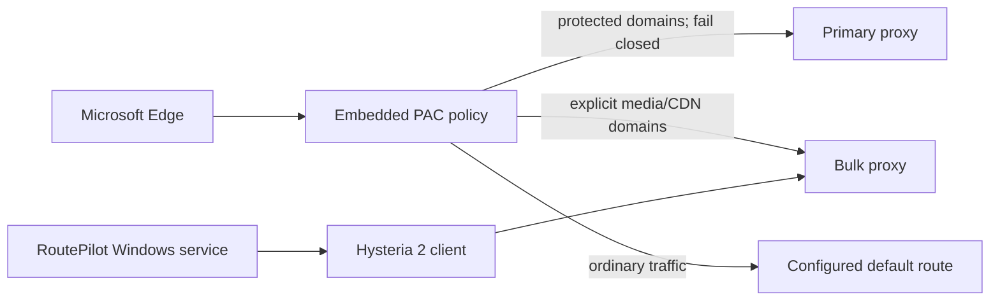

# RoutePilot for Windows

RoutePilot is a local, fail-closed split-routing toolkit for Windows. It keeps protected account and control-plane traffic on a trusted local proxy while sending explicitly listed media and large-download domains to a separate high-throughput proxy.

It is designed for people who already operate two authorized proxy endpoints and want reproducible routing, health checks, least-privilege service hosting, and a clean rollback path. RoutePilot does not provide proxy servers, credentials, or access to third-party services.

[中文说明](README.zh-CN.md)

## Why RoutePilot

- Protected domains never fall back to `DIRECT` or the bulk route.
- Only explicitly listed payload/CDN domains use the bulk route.
- Microsoft Edge receives an embedded PAC policy, so no local PAC web server is required.
- A small Windows service can supervise a Hysteria 2 client under `LocalService`.
- Third-party binaries are downloaded only on demand and verified against official release hashes.
- Local configuration, runtime state, logs, and binaries are excluded from Git.
- Installation is reversible and covered by offline tests.

## Architecture



See [Architecture](docs/architecture.md) and [Security model](docs/security-model.md) for details.

## Requirements

- Windows 10 or Windows 11
- Windows PowerShell 5.1 or PowerShell 7
- Node.js for the PAC test
- Microsoft Edge for the included policy installer
- An existing primary HTTP proxy
- An optional Hysteria 2 server you are authorized to use

## Quick start

Clone the repository and create local configuration files:

```powershell
Copy-Item .\config\routepilot.example.json .\config\routepilot.local.json
Copy-Item .\config\hysteria-client.example.yaml .\config\hysteria-client.local.yaml
```

Edit both local files. Placeholder credentials must be replaced locally and must never be committed.

Generate and test the PAC file without changing Windows:

```powershell
.\scripts\New-RoutePilotPac.ps1
node .\tests\Test-RoutingPac.js .\runtime\routepilot.pac .\config\routepilot.local.json
```

If you use Hysteria 2 for the bulk route, explicitly download and verify the official Windows binary:

```powershell
.\scripts\Download-Hysteria.ps1
```

Install the Hysteria client as a low-privilege Windows service from an elevated PowerShell terminal:

```powershell
.\scripts\Install-HysteriaService.ps1 `
  -HysteriaExecutable .\runtime\hysteria\hysteria-windows-amd64.exe `
  -ClientConfig .\config\hysteria-client.local.yaml `
  -DataRoot D:\RoutePilotData
```

If the YAML references a private CA file, also pass it with `-AdditionalReadPath` so the service can read it.

Apply the Edge routing policy:

```powershell
.\scripts\Install-EdgeRouting.ps1
```

Restart Edge, then run the health check:

```powershell
.\scripts\Test-RoutePilotHealth.ps1
```

## Rollback

Restore the previous Edge proxy policy:

```powershell
.\scripts\Restore-EdgeRouting.ps1
```

Remove the Windows service while retaining diagnostic data:

```powershell
.\scripts\Uninstall-HysteriaService.ps1
```

## Tests

```powershell
.\tests\Test-PowerShellSyntax.ps1
.\tests\Test-ConfigValidation.ps1
.\scripts\New-RoutePilotPac.ps1 -ConfigPath .\config\routepilot.example.json
node .\tests\Test-RoutingPac.js .\runtime\routepilot.pac .\config\routepilot.example.json
.\scripts\Build-Service.ps1
.\tests\Test-NoSecrets.ps1
```

## Responsible use

Use RoutePilot only with systems and network endpoints you own or are authorized to administer. Follow applicable laws and the terms of the services you access. The project is not intended to bypass account controls, payment controls, access restrictions, or platform enforcement.

## License

[MIT](LICENSE)
